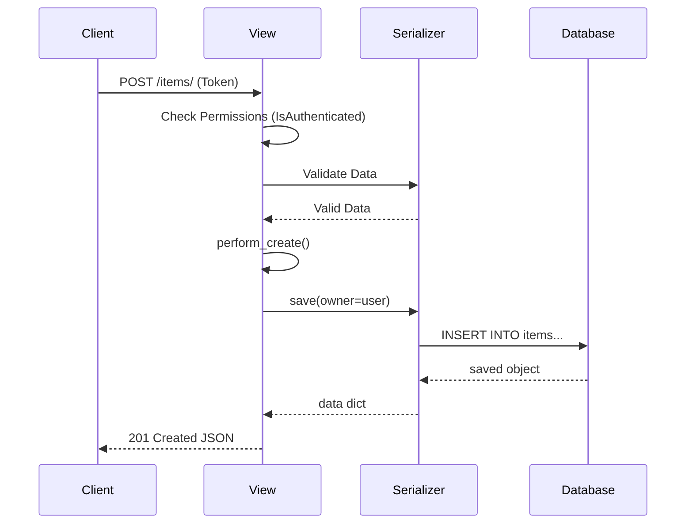

# Django View Explanation: Real-World Example

This example demonstrates CodeGuru explaining a realistic Django View.

**Command used:**
```bash
python chat.py
```
**Code:**
```python
from rest_framework import generics
from rest_framework.permissions import IsAuthenticated
from .models import Item
from .serializers import ItemSerializer

class ItemListCreateView(generics.ListCreateAPIView):
    serializer_class = ItemSerializer
    permission_classes = [IsAuthenticated]

    def get_queryset(self):
        return Item.objects.filter(owner=self.request.user)

    def perform_create(self, serializer):
        serializer.save(owner=self.request.user)
```

**Question:**
"Explain this Django REST Framework view and why get_queryset is overridden"

---

## 🤖 CodeGuru Explanation

This is a **Django REST Framework (DRF)** generic view for handling API requests. Let's break it down concept by concept.

### 1. View Type: `ListCreateAPIView`

This class handles two standard HTTP methods automatically:
- `GET /items/` -> Lists all items (calls `ListModelMixin`).
- `POST /items/` -> Creates a new item (calls `CreateModelMixin`).

It connects your database model (`Item`) to your API serializer (`ItemSerializer`).

---

### 2. Permissions: `IsAuthenticated`

```python
permission_classes = [IsAuthenticated]
```
- **What:** Ensures only logged-in users can access this endpoint.
- **How:** DRF checks `request.user` before calling the view logic.
- **Why:** Security. Anonymous users receive a `401 Unauthorized` or `403 Forbidden`.

---

### 3. Queryset Filtering: `get_queryset`

```python
def get_queryset(self):
    return Item.objects.filter(owner=self.request.user)
```
- **Concept:** Row-level security (filtering data per user).
- **Default behavior:** Usually `queryset = Item.objects.all()` returns *everyone's* items.
- **Override logic:** By overriding `get_queryset`, we dynamically filter the list based on the *current request user*.
- **Result:** User A sees only User A's items. User B sees only B's items.
- **Best Practice:** Always filter sensitive data based on ownership, not just authentication.

---

### 4. Custom Creation Logic: `perform_create`

```python
def perform_create(self, serializer):
    serializer.save(owner=self.request.user)
```
- **Concept:** Hook method (intercepting the save process).
- **Why needed:** When a user POSTs data `{"name": "My Item"}`, they don't send `owner_id`. It's inferred from their request context.
- **What happens:** 
    1. View receives POST data.
    2. Validates data with `ItemSerializer`.
    3. Calls `perform_create`.
    4. We inject `owner=request.user` into the save method.
    5. Item is saved to DB with correct owner.

---

### 5. Flow Diagram



---

*Generated by CodeGuru using Groq Llama 3 70B.*
